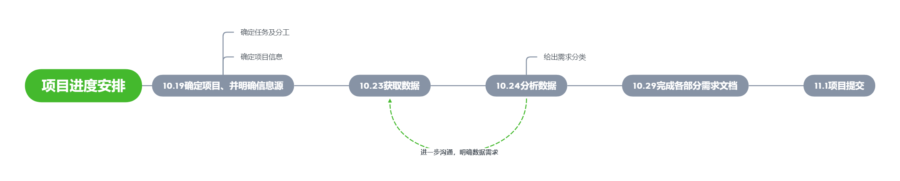

# 任务说明

| 修改人员 |    日期    |     变更原因     | 版本号 |
| :------: | :--------: | :--------------: | :----: |
|  刘国涛  | 2020.10.18 | 创建任务说明文档 |  v1.0  |
|  龚雨彤  | 2020.10.30 | 完成实验 |  v2.0  |

[TOC]

## 选题

|   选题要素   |                     选题内容                     |
| :----------: | :----------------------------------------------: |
|   实验对象   |                     VSCODE                       |
|    信息源    |            Github Issue,Stack Overflow           |
| 数据获取方式 |                 爬虫，人工获取                    |
|   需求分析   |              可视化处理、人工分析                |
| 需求分类方式 |                     人工分析                     |

## 分工

|      任务列表      |   负责人   |    状态   |
| :----------------: | :--------: | :------: |
|      确定项目      |   所有人   | FINISHED |
|     确定信息源     |   所有人   | FINISHED |
|      获取数据      |   刘国涛   | FINISHED |
|      分析数据      |   所有人   | FINISHED |
| 编写各部分需求文档 |   所有人   | FINISHED |

## 项目进度安排

